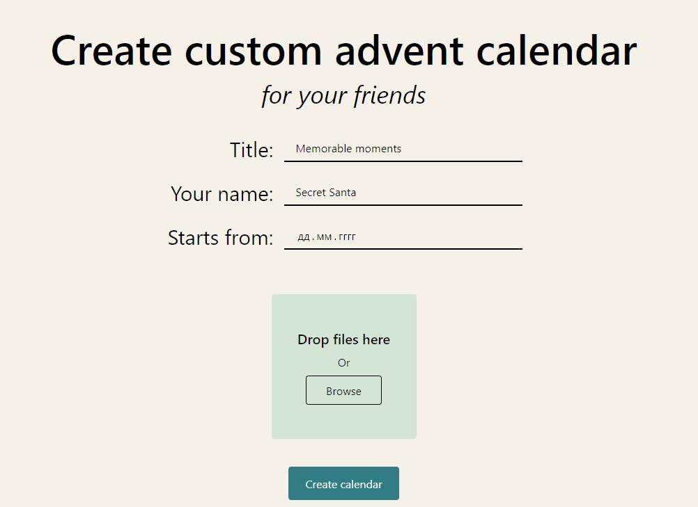

# [Advent calendar](https://youradvent.vercel.app/)

[](https://youradvent.vercel.app/)

## API Reference

### Create new calendar:

POST to the /create [endpoint](https://adventcalendar-legoushka.amvera.io/create)

Returns JSON with .generatedId string.

Using this ID you can fetch general information and content of calendar with this ID

```json
{
    "title": string,
    "author": string,
    "startDate": int,
    "daysDuration": int,
    "calendarCells":
    [
        {
            "number": int,
            "header": string,
            "text": string,
            "imageB64": string
        }
    ]
}
```

### Get calendar general info:

GET from /calendar/data/id [endpoint example](https://adventcalendar-legoushka.amvera.io/calendar/data/errors-by-Lalacode-ab1ce556-3432-4806-b625-8ce6eeb2dd8c)

```json
{
    "title": string,
    "author": string,
    "startDate": int,
    "daysDuration": int
}
```

### Get calendar content:

GET from /calendar/images/id [endpoint example](https://adventcalendar-legoushka.amvera.io/calendar/images/errors-by-Lalacode-ab1ce556-3432-4806-b625-8ce6eeb2dd8c)

```json
[
        {
            "number": int,
            "header": string,
            "text": string,
            "imageB64": string
        }
    ]
```

## Possible names

    "AdventDelights"
    "DailyGiftCo"
    "YourAdventCalendar"
    "GiftOfTheDay"
    "AdventGiftHQ"
    "DailySurprises"
    "AdventCalendarCo"
    "YourGiftADay"
    "AdventCalendarGuru"
    "DailyDelights"
    "AdventGiftCo"
    "CountdownHQ"
    "GiftGenie"
    "GiftBoxx"
    "UnwrapJoy"
    "AdventTreats"
    "SeasonalSurprises"
    "CalendarCraze"
    "HolidayHappenings"
    "GiftADay"
